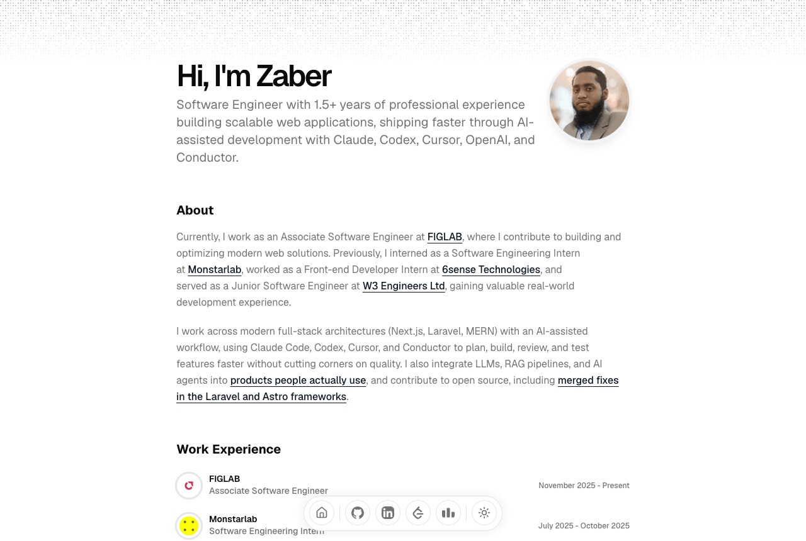

# Zaber Bin Zahid — Portfolio

Personal portfolio and blog of Chowdhury Zaber Bin Zahid, a software engineer from Dhaka, Bangladesh.

**Live:** [zaber47.vercel.app](https://zaber47.vercel.app)

[](https://astro.build)
[](https://tailwindcss.com)
[](https://react.dev)
[](./LICENSE)

<picture>
  <source media="(prefers-color-scheme: dark)" srcset="docs/preview-dark.png">
  
</picture>

The site is built with [Astro 7](https://astro.build) and ships as static HTML. React is used only for the
parts that need interaction, as Astro islands that hydrate when they scroll into view or when the browser is
idle. All personal content lives in one data file, so the site is easy to fork and make your own.

## Features

- **Projects** as a text-first list. Each project shows a summary, tech tags, and links, with the full
  description and an optional screenshot behind a Details toggle. Screenshots only download when opened.
- **Open source contributions** in a carousel that auto-scrolls, pauses on hover or focus, and can be dragged
  with inertia. Only merged pull requests are shown; open ones stay in the data until they merge.
- **Skills** in a three-row marquee. Icons are rendered once into an SVG sprite instead of being repeated.
- **Recommendations** carousel that resizes to the active review, so a long review never stretches the others.
- **Contact** with a WhatsApp link and a Cal.com booking modal. The Cal.com script loads on first interaction
  with the button, follows the site theme, and never stacks two modals.
- **MDX blog** with content collections, Shiki light and dark highlighting, titled code blocks with a copy
  button, pagination, and previous and next post links.
- **OpenGraph images** generated at build time with Satori for the home page, the blog, and every post.
- **SEO**: canonical URLs, Open Graph and Twitter meta, `Person` and `BlogPosting` structured data, a sitemap,
  and `robots.txt`.
- **Performance**: build-time WebP images with 1x and 2x sources, self-hosted Geist fonts through the Astro
  Fonts API, and a single small stylesheet.
- **Light and dark theme** saved in `localStorage`, applied before first paint, and `prefers-reduced-motion`
  respected by every animation.

## Lighthouse

Measured on the live site.

| | Performance | Accessibility | Best Practices | SEO |
| --- | --- | --- | --- | --- |
| Desktop | 100 | 100 | 100 | 100 |
| Mobile | 93–99 | 100 | 100 | 100 |

Mobile performance varies between runs because Lighthouse simulates a slow 4G connection.

## Tech stack

| Area | Choice |
| --- | --- |
| Framework | Astro 7 with the MDX, React, and sitemap integrations |
| Styling | Tailwind CSS 4 through `@tailwindcss/vite`, with `@tailwindcss/typography` |
| Interactive islands | React 19, Radix UI (accordion, tooltip), Motion |
| Content | Astro content collections for the blog, one TypeScript data file for everything else |
| Images | `astro:assets` with Sharp; Satori for OpenGraph images |
| Icons | Lucide and react-icons |
| Hosting | Vercel (static output, security headers in `vercel.json`) |

## Getting started

Requires Node.js 22.12 or newer and [pnpm](https://pnpm.io).

```bash
pnpm install
pnpm dev        # http://localhost:4321
pnpm build      # static site in dist/
pnpm preview    # serve the production build
pnpm check      # type-check .astro and .ts files
pnpm favicons   # regenerate favicons from the profile photo
```

## Make it yours

1. **Fork or clone** this repository.
2. **Edit `src/data/resume.ts`.** It holds the name, site URL, headline, about text, skills, contact details,
   work history, education, projects, open source contributions, and recommendations.
   - Skill icons are referenced by name. The available icons are listed in `src/data/icons.ts`.
   - `contact.tel` is used for the WhatsApp button and `contact.calLink` for the Cal.com booking
     (for example `your-username/30min`).
3. **Replace the images** in `src/assets/images/`. Entries in `resume.ts` point at them by file name, such as
   `"/me.jpeg"`. Project screenshots are optional; a project without one simply shows no image.
4. **Update the sitemap URL** in `public/robots.txt` to your own domain.
5. **Run `pnpm favicons`** to generate the favicon set from your photo at `src/assets/images/me.jpeg`.
6. **Replace or delete the sample posts** in `src/content/blog/`. They are placeholders kept from the
   original template.
7. **Deploy.** On Vercel it works with no extra setup. Any static host works too: upload the `dist/` folder.

## Writing blog posts

Add an `.mdx` file to `src/content/blog/`. The frontmatter fields are defined in `src/content.config.ts`:

```mdx
---
title: "My post"
publishedAt: "2026-09-15"
summary: "One sentence used for the post list and social previews."
image: "/optional-cover.png"
---
```

- Add a title to a code block with ` ```ts title="file.ts" `.
- Embed an image or video with `<MediaContainer src="..." alt="..." />`.

## Project structure

```text
src/
  assets/         Fonts for OpenGraph images, and all site images
  components/
    section/      Home page sections (projects, open source, skills, contact, ...)
    magicui/      Dock navbar and flickering grid background
    mdx/          Components used inside blog posts
    ui/           Small shared primitives (accordion, button, tooltip)
  content/blog/   MDX posts
  data/           resume.ts (all site content) and icons.ts (skill icons)
  layouts/        Base layout: head tags, fonts, theme script, navbar
  lib/            Image optimization, Markdown, OpenGraph rendering, blog helpers
  pages/          Home, blog, 404, and OpenGraph image endpoints
  styles/         Tailwind theme and global styles
public/           Favicons, web manifest, robots.txt
scripts/          Favicon generator
docs/             README screenshots
```

## License

The code is released under the [MIT License](./LICENSE). This project started from
[dillionverma/portfolio](https://github.com/dillionverma/portfolio), which is also MIT licensed.

The personal content is not covered by the license. That includes the text about me, my photo, recommendations
and the photos of the people who wrote them, company logos, and project screenshots. If you reuse this project,
please replace that content with your own.
